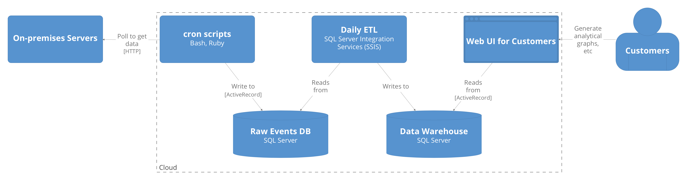
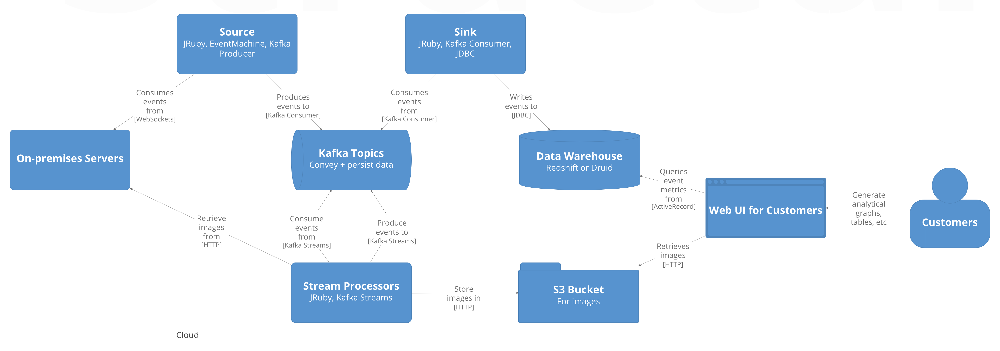

autoscale: false
theme: Merriweather, 8
build-lists: true

[.header: text-scale(1.4)]
[.text: text-scale(1.4)]

# Refactoring a Global Data Pipeline with Kafka Streams and Ruby

**A Case Study**

Avi Flax
September 2020

----
[.header: text-scale(1.5)]
[.text: text-scale(1.5)]

## The Product

A **Parking Guidance & Information** (PGI) system

^
• The Product: a parking guidance system
• Installed in hundreds of multi-level parking structures around the world

----
[.header: text-scale(1.5)]
[.text: text-scale(1.4)]

## Components

* **On-prem:**
	* Sensors + Servers
* **Cloud:**
	* Monitoring
	* Configuration
	* Analytics
	* Web UI

^
• These are some of the core components of the product
• Those cloud elements were implemented as a single-instance multi-tenant system
• The
Hundreds of customers using that cloud-based Web app

----
[.text: text-scale(1.4)]

## Analytics Pipeline

1. Get the data
2. Clean the data
3. Store the data

^
• The problems I needed to solve were part of that analytics feature
• Specifically, the pipeline that conveyed the crucial event data from the sites to the cloud-based system where the customers could query it, visualize it, etc.
• «reveal»
• The job of the pipeline was, at a high level, simple
• But there were a lot of details that made it not so simple

----
[.text: text-scale(1.4)]

## Problems

* High latency
* Low reliability

^
• The old pipeline had some big problems «reveal»
• Basically, it’d been designed and implemented when the number of customers was much smaller;
  • as the customer base grew it’d hit its scaling limit and was now overdue to be refactored.

----
[.text: text-scale(1.4)]

## Primary Goals

* ~~High~~ **Low** latency
* ~~Low~~ **High** reliability

## Secondary Goals

* More events
* Retrieve images

^
• 1 nice thing; main goals of new pipeline very clear: «reveal»
• Secondary goals were new features; were impossible with old pipeline «reveal»

----

# Architectural Style

^
• We knew from the start that we wanted to adopt streaming transport+processing
• My obsession with streaming was a big driver for the project
• So we kicked the project off by choosing the set of technologies that we’d use

----
[.text: text-scale(1.5)]

## Technology Choices

Role | Options Considered
---- | ------------------
Transport | **Kafka** Kinesis
Processing | **Kafka Streams** Samza Storm
Programming | Clojure Java Kotlin **Ruby** Scala

^
• Walk through options + choices
• Mention tension, prototyping

----

^
• Basically just a set of cron scripts that polled the on-prem servers on a fixed schedule

----
[.text: text-scale(1.2)]

**New (Streaming)**

----
