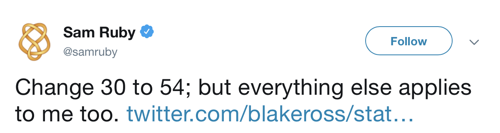
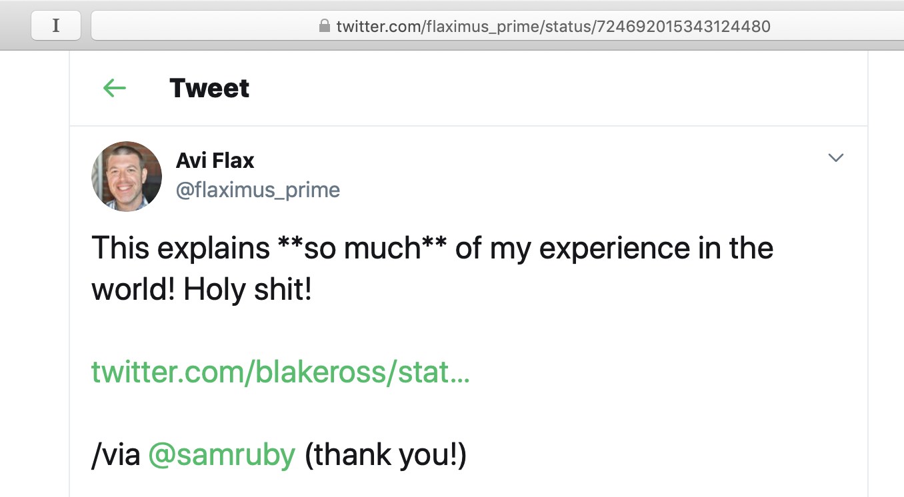
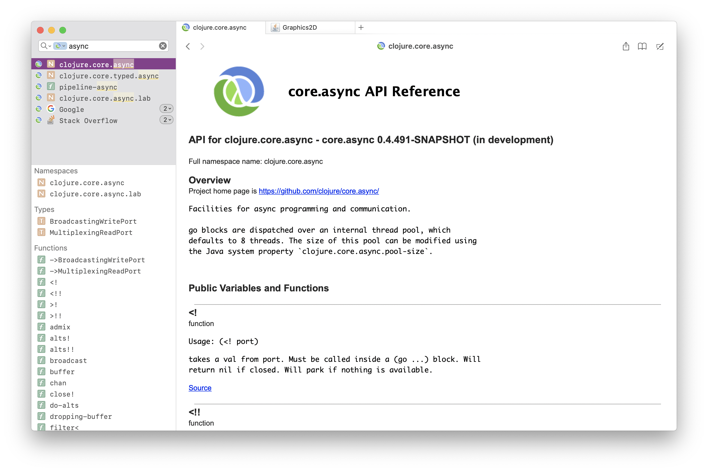
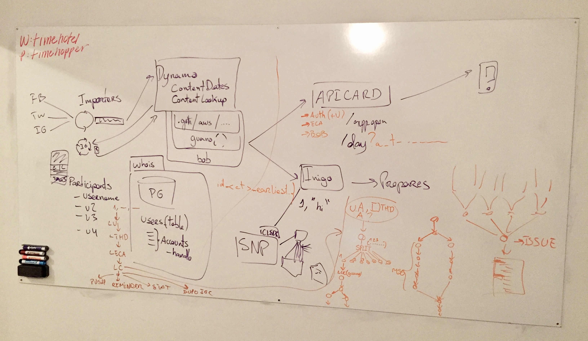
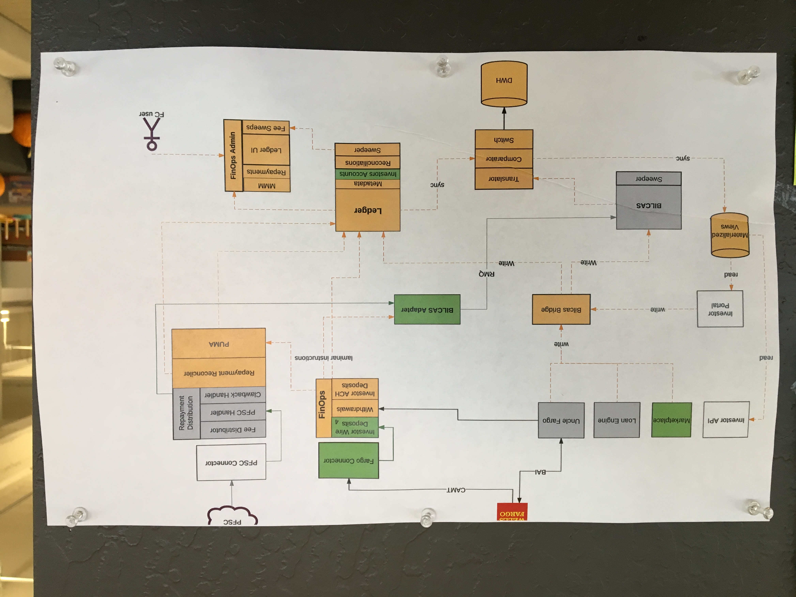
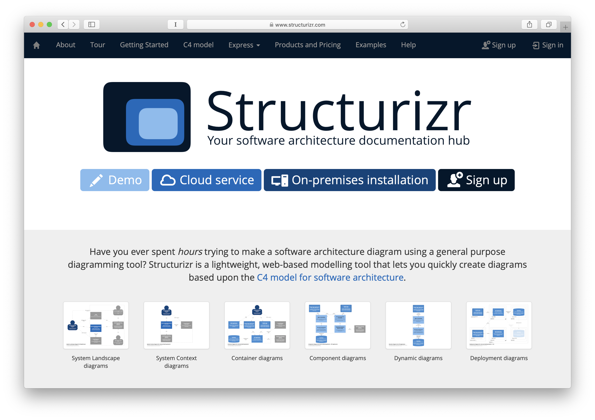
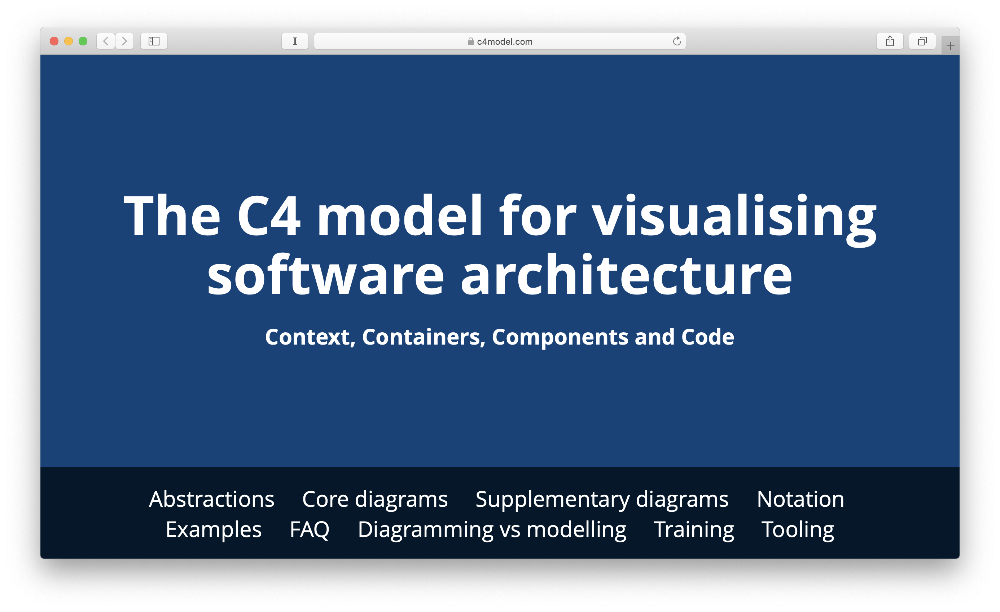
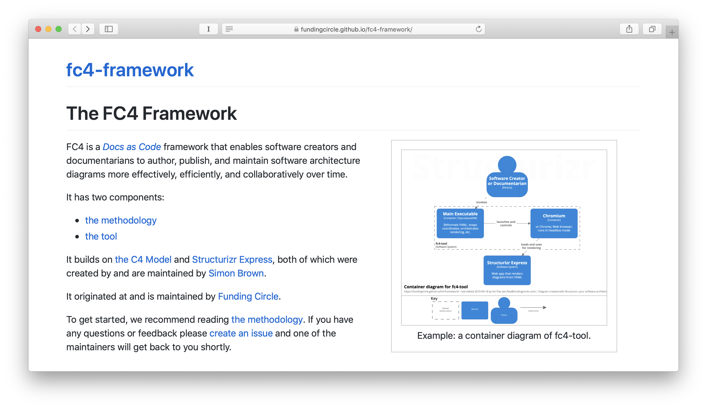

[.text: alignment(center)]

# [fit] Software Architecture
# [fit] Diagrams
# [fit] as Data

First Edition ❣️ by Avi Flax ❣️ https://git.io/Je8k6

---
# Data Driven Diagramming v1

Or: _Diagrams as Code_?

Or: _Data-Oriented Diagramming_?

Or: _Diagrams as Data_?

Or: _(Architecture) Diagrams as Data_?

----

[??]

- Today I’d like to share some thoughts on something that may seem prosaic, maybe even mundane
- I get that it might be hard to muster up much excitement about software architecture diagrams
- But it’s a topic that _I do_ get excited about
- So I’m going to try to convince you that maybe you should care a little bit too

----

[various diagrams]

Architecture diagrams are a powerful and widely used medium for teaching and learning about software systems.

They’re so commonplace that many of us rarely stop to think about how they are created and maintained.

Well, I’ve been creating and maintaining diagrams like these for decades.

----

[¿a giant question mark?]

Over time, I started asking myself: why am I always, inevitably, inexorably, drawn towards diagrams and diagramming?

Every time I start a new job, or switch teams, I invariably look for diagrams that can help me learn about my new context — and often I don’t find any, so I create them myself.

What’s going on here?

----

[blank, or maybe a blurry diagram]

This was puzzling to me for a long time, because I don’t think of myself as a visual person.

In fact, let me tell you a story.

----

^ In April 2016, I was scrolling through my Twitter timeline when I came across this tweet by Sam Ruby (who’s currently the president of Apache) which linked to a tweet by Blake Ross, one of the creators of Firefox.

----

^ Ross’s tweet linked to this essay he’d just written.

^ I followed the link and started reading, and I was astounded.

^ And that’s how I found out that I have a neurological condition called aphantasia.

^ Aphantasia means that I don’t have a functioning “mind’s eye”

^ I don’t — _can’t_ — visualize images in my head

----

^ Suddenly, lots of random idiosyncrasies, tics and quirks of mine fit together, made sense, had a unifying narrative.

^ In particular, I now, for the first time, had a plausible hypothesis for the quirks of my memory; specifically, how my memory works — or doesn’t.

----

[??]

Now, unfortunately, we don’t have time for a comprehensive discussion of how my memory works. But we can discuss one aspect that’s relevant: that I’m basically incapable of memorization.

It’s not that I’m unable to learn new information, and not that I’m unable to access information I’ve previously learned.

I can learn. Just not through memorization. In fact, I have no idea how to even begin to try to memorize anything.

I see memorization as a kind of brute-force technique that is just incompatible with my wetware. Instead, the only way for me to retain anything usefully is to **really** learn it. To learn it as a system, as a network of connected information, a web, etc. To **understand** it.

The thing is, though: to truly understand something takes time — often a lot of time.

----

[???]

In a world that often equates memory with intelligence, I have developed habits and strategies to compensate for my inability to memorize — for example, I rely heavily on reference materials while writing programs.

----

^ For example, this is Dash, one of my favorite programming tools. It downloads and indexes API docs, so I can search and browse them extremely quickly, even when offline.

^ I’ve come to believe that I use diagrams similarly to how I use API docs like these: as a reference, as a sort of an external memory or external index for the systems that I need to work with.

^ There’s another kind of visualization that will be familiar to most of you — a visualization that people often use to get their bearings in a new context, and to learn about that context.

----

[map or maps]

When a person enters a new geographical environment, they’ll often refer to maps to get their bearings in that environment and to navigate that environment, until they’ve eventually committed the geographical information they need regularly to memory — in other words, until they’ve learned that environment.

I believe that, for me, a diagram of a system is akin to a map: a way for me to get my bearings in that system, so I can get right to work and be effective well before I’ve attained a comprehensive understanding of that system.

Because I can and will eventually commit structures like these to memory — somehow, I learn them, and I can recall the relationships. Not visually, but semantically.

----

[??]

I think this is why I find diagrams so crucial when I’m in a new context — they enable fast and effective **reference** _and_ fast and effective **learning**.

I’d like to posit here today that while this may be _especially_ true for me, and maybe for others with aphantasia, I suspect this also holds true for neurotypical folks.

So basically, diagrams are a fast and effective medium for reference and learning, that can help people be more effective faster, in new contexts.

Great. Diagrams are awesome. End of talk, maybe?

----

[??]

Not so fast.

Diagrams are awesome, but the most common approaches to creating maintaining, and publishing them are definitely not awesome. They’re highly lacking in awesomeness.

----

^ Have any of you ever joined a new team and asked someone if any diagrams exist, only to have that person lead you over to a whiteboard and start scribbling and freestyling some diagrammatic impressionist art, accompanied by stream-of-consciousness narration?

^ I certainly have.

----

^ Have any of you ever joined a new team, looked for diagrams, found some promising ones pinned up to the wall on paper, but when you ask who made them and when, you just get shrugs? Or “oh, they left last year”?

^ I certainly have.

----

[?? screenshot of last-updated timestamp? Maybe papyrus? Old software books?]

Have you ever asked someone to work with you to create a diagram, and they declined because, according to them, “documentation is always out of date”

I certainly have.

----

^ Have you ever rejoiced at actually finding the source file for a useful diagram that needs to be updated — only to be unable to change it, for lack of a proprietary and expensive software license?

^ I certainly… you get the idea.

----

[?? maybe video of tweaking layout?]

Have you ever struggled to get the elements of a diagram laid out evenly and consistently, cursing every moment of it, because what the hell, computers were supposed to eliminate this kind of drudgery years ago!

----

[??]

I’ve been creating and maintaining diagrams for decades, and I’ve been perennially frustrated by experiences like these.

I’d regularly look around to try to find new tools and techniques that might address these frustrations, but I never found anything satisfactory.

Until recently.

----

[obligatory morpheus image macro]

What if I told you…

…that there’s a technology that can radically transform how we create, maintain, and publish our diagrams?

A technology that many of us already use every day, when writing programs?

----

[??]

That’s right, it’s **data in text files!**

----

[¿trollface?]

No, really. I’m not trolling you, I promise.

----

[??]

As as many of us might already know, in Clojure, and all Lisps, code is data.

We represent our code in text files using our language’s native data structure literals.

This makes it trivial to generate code and trivial to parse code — and once it’s parsed you can manipulate it, analyze it, project it, transform it, translate it, graph it, etc.

You can do all sorts of fun things!

----

[??]

Wouldn’t it be cool if we could express our architecture diagrams as _data in text files_ so that we could then do some of these fun things with our diagrams?

I think that would be super cool!

----

[??]

Using _Data in text files_ would also enable us to leverage all the rich, robust tools and workflows that have been developed over decades to facilitate and support collaboration via text files: version control systems (VCSs) such as [Git](https://git-scm.com/) and collaboration systems built on those VCSs such as [GitHub](https://github.com/), [GitLab](https://gitlab.com/), [BitBucket](https://bitbucket.com/), [Gerritt](https://www.gerritcodereview.com), [Phabricator](https://www.phacility.com/phabricator/), etc.

Those systems are fantastic for collaboration, but they’re optimized for collaborating on _text files_ — they can do very little with the proprietary binary file formats used by many diagramming tools.

----

Now, you might be thinking — don’t we already have tools that can render diagrams from data in text files? Tools like [Graphviz](http://graphviz.org), [PlantUML](http://plantuml.com), [Mermaid](http://knsv.github.io/mermaid/#/), etc?

Well, yes, those tools do exist. I’ve tried many over the years. Unfortunately, none of them have ever felt like a good fit for software _architecture_.

There are a few reasons for this.

----

[image of a very graph-y graph]

For example, Graphviz is a very well known tool. And it’s an excellent tool.

Unfortunately, Graphviz is all about graphs! _Mathemetical_ graphs.

So it makes composition and nesting quite awkward.

----

[image of composed/nested elements on an architecture diagram]

Which is unfortunate, because nested elements are an extremely useful notation to include in an architecture diagram!

----

[??]

All or most of these tools support only algorithmic layouts when rendering diagrams — meaning the tool decides where to postion all the elements, how to route the relationship lines, etc.

This is great when one has a large dataset on hand and one is creating a visualization in order to explore that data, to seek new insights.

But it’s not at all great when one is _authoring_ the data specifically in order to create a visualization designed to _convey_ a coherent _story_ about about those elements.

It turns out that when one _is_ trying to convey a coherent story about a set of elements, it’s extremely useful to be able to specify the relative positioning of those elements.

Whenever I tried Graphviz, I’d find myself wrestling with its algorithms just to get things laid out clearly and usefully.

----

[??]

Finally, there’s the problem of how general-purpose these tools are.

Mermaid alone supports flowcharts, sequence diagrams, class diagrams, state diagrams, Gannt charts, and Pie charts. PlantUML supports at least 18 kinds of diagrams.

The generality of these tools means that they have no specific notations or conventions specifically for software architecture diagrams.

In other words, they lack a _conceptual model_ for _how_ to author architecture diagrams.

In my experience, the lack of a clear, robust, well-defined conceptual model is a major impediment to people getting involved with creating and maintaing architecture diagrams — it can be daunting to have to figure out on one’s own how to craft a good diagram.

(To be clear, those tools are great for lots and lots of use cases. I just don’t think they’re great for this very specific use case: software architecture diagrams.)

----

[??]

- So when I started a new job two years ago
- I once again felt the need to create a bunch of architecture diagrams
	- to get my bearings in a new context
- I once again tried a few tools that could render diagrams from data in text files — even tried hacking something up with HTML+CSS
- But I was once again stymied, and once again fell back to using GUIs with proprietary binary file formats ([OmniGraffle](https://www.omnigroup.com/omnigraffle), [LucidChart](https://www.lucidchart.com/), Graphviz, [Keynote](https://www.apple.com/keynote/))
- I was bummed, and I kept randomly searching the web for diagramming tools… EDIT

----

^ And then I stumbled across Structurizr

---

^ This is structurizr.com.

^ I’m not going to make you squint; I’ll read you the description right there in the center of the page:

^ > Have you ever spent _hours_ trying to make a software architecture diagram using a general purpose diagramming tool? Structurizr is a lightweight, web-based modelling tool that lets you quickly create diagrams based upon the [C4 model for software architecture](https://c4model.com/).

^ Oooh, the C4 model… what’s that? (Or maybe: I’d never clicked a link so fast in my life (or something like that.))

----

^ Turns out, I wasn’t the only one who’d been frustrated with this situation

^ But unlike me, a [Jerseyman](https://www.newworldencyclopedia.org/entry/Jersey#Demographics) named [Simon Brown](https://simonbrown.je/) had actually _done something_ about it

----

[screenshot of c4model.com]

Simon Brown created the C4 model.

----

[screenshot of c4model.com]
[screenshot of structurizr.com]

Simon Brown created Structurizr, a Web-based system for hosting, browsing, and publishing C4 diagrams.

----

[screenshot of c4model.com]
[screenshot of structurizr.com]
[screenshot of Structurizr Express]

- And Simon Brown created Structurizr Express
- SE is a single-page Web app that:
	- defines a simple data model for C4 diagrams
	- enables authoring C4 diagrams as YAML or JSON data as text
	- enables authoring C4 diagrams graphically
	- and it keeps them in sync!
	- editing the data updates the graphic, and vice-versa!

----

[??]

* I was super-excited when I found SE, and started using it immediately
* I found that it got me 90% of the way towards my architecture diagramming nirvana
* Not only that, but I was able to fill in the remaining 10% with my own code
	* (Clojure code, of course)
* At first, I just whipped up a few quick-and-dirty REPL functions
	* But as more people started using them, eventually those scripts turned into a packaged, documented tool

----

* I bundled the tool together with a documented methodology for using it
	* and called the whole bundle the FC4 Framework
* FC4 wraps SE and thereby facilitates additional use cases:
	* maintaining diagram source files as YAML files in a git repo
	* reformatting and normalizing the diagram source files to prevent noisy diffs
	* automatically snapping the elements in a diagram to a virtual grid
		* to eliminate the drudgery of lining things up in a fiddly GUI
	* automatically rendering those diagrams from YAML to images

----

[short video showing an FC4 authoring session]

- Here’s a quick authoring session
- To recap, what you’re seeing here is:
	- the user opens up a project that’s a local git repository in their text editor
	- the project consists of data in text files
	- those text files contain YAML data structures that define C4 software architecture diagrams
	- the user runs fc4, which stays open in the background, watching the YAML files
	- when the user changes part of the YAML source, 

----

[??]

----

[??]

----

[??]

----

[??]

----

[??]

----

[??]
